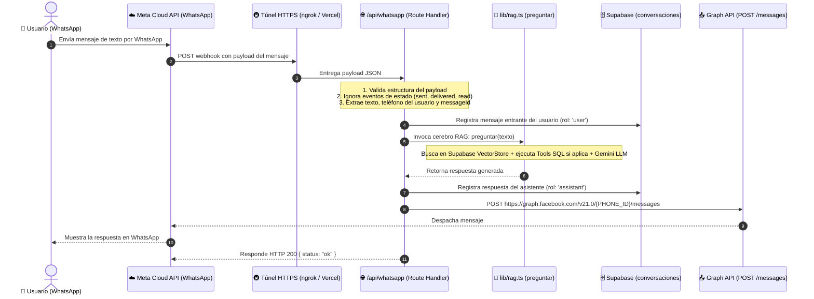

# Arquitectura y Configuración del Canal WhatsApp (Meta Cloud API)

Este documento detalla la guía paso a paso para configurar **Meta for Developers**, obtener las credenciales de la **WhatsApp Cloud API**, y la arquitectura técnica del webhook que conecta WhatsApp con el cerebro RAG de **chatIA**.

---

## 1. Flujo de Integración de Extremo a Extremo



---

## 2. Paso a Paso: Configuración en Meta for Developers

### Paso 2.1: Crear la App en Meta
1. Ingresa a la consola de desarrolladores en [developers.facebook.com/apps](https://developers.facebook.com/apps/) e inicia sesión con tu cuenta de Facebook/Meta.
2. Haz clic en el botón **"Crear app"** (*Create App*).
3. En la selección de caso de uso o tipo de app:
   * Selecciona **"Otro"** (*Other*) y pulsa **Siguiente**.
   * Selecciona el tipo de app **"Negocios"** (*Business*) y pulsa **Siguiente**.
4. Completa el formulario básico:
   * **Nombre de la app:** Asigna un nombre identificativo (ej. `chatia-bot` o `novatech-assistant`).
   * **Correo de contacto:** Tu correo electrónico habitual.
   * **Cartera comercial / Business Account:** Selecciona tu cuenta de negocio si dispones de una, o permite que Meta cree una por defecto.
5. Haz clic en **"Crear app"** y completa la comprobación de seguridad si te lo solicita.

---

### Paso 2.2: Agregar el Producto WhatsApp
1. En el panel principal de la aplicación (*App Dashboard*), busca la sección **"Agregar productos a tu app"** (*Add products to your app*).
2. Localiza la tarjeta de **WhatsApp** y presiona **"Configurar"** (*Set up*).
3. Acepta los términos de servicio de la API de WhatsApp Business.

---

### Paso 2.3: Obtener las Credenciales de la API

En el menú lateral izquierdo de tu app en Meta, navega a:
**WhatsApp** ➔ **Configuración de la API** (*API Setup* o *Introducción*).

En esa pantalla encontrarás las tres credenciales fundamentales:

| Credencial | Dónde ubicarlo en Meta | Variable en `.env` | Descripción |
|---|---|---|---|
| **Access Token Temporal** | Campo *"Token de acceso temporal"* con botón *Copiar* | `WHATSAPP_ACCESS_TOKEN` | Token Bearer para autenticar llamadas de salida hacia la Graph API. En pruebas dura 24 horas. |
| **Phone Number ID** | Casilla *"Identificador de número de teléfono"* | `WHATSAPP_PHONE_NUMBER_ID` | Identificador numérico del número telefónico emisor de pruebas asignado por Meta. *(Nota: no confundir con el WABA ID ni con el número de teléfono con signo +)*. |
| **Verify Token** | **Lo inventas tú** libremente | `WHATSAPP_VERIFY_TOKEN` | Cadena secreta arbitraria para el handshake de verificación entre Meta y tu servidor. |

> [!WARNING]
> En la sección de configuración de Meta aparecen dos identificadores parecidos:
> 1. **Identificador del número de teléfono** (Phone Number ID) ➔ **ESTE es el que debes usar**.
> 2. **Identificador de la cuenta de WhatsApp Business** (WABA ID) ➔ No se usa para el envío de mensajes ordinarios.

---

### Paso 2.4: Autorizar tu Teléfono para Pruebas (Lista de Destinatarios)

En el entorno de desarrollo y pruebas de Meta, la app se encuentra en modo *Development*. Por políticas de privacidad, solo puede intercambiar mensajes con números autorizados:

1. En la misma pantalla de **Configuración de la API**, localiza la sección **"Paso 1: Seleccionar números de teléfono"** o el selector desplegable **"Para" (*To*)**.
2. Despliega la lista y selecciona **"Administrar lista de números de teléfono"** (*Manage phone number list*).
3. Añade tu número de teléfono móvil personal con el código de país (ejemplo: `+58...`, `+54...`, `+34...`, etc.).
4. Meta te enviará un código de verificación de 6 dígitos por WhatsApp. Introdúcelo en la pantalla para validar la posesión del número.
5. **Prueba de envío inicial:** Haz clic en el botón azul **"Enviar mensaje"** (*Send test message*). Deberías recibir un mensaje con la plantilla de bienvenida `"Hello World"` en tu WhatsApp.

---

## 3. Variables de Entorno del Proyecto

Crea o actualiza las siguientes variables en tu archivo `.env` o `.env.local` en la raíz del proyecto:

```env
# ========================================================
# CREDENCIALES EXISTENTES
# ========================================================
GOOGLE_API_KEY="AIzaSy..."
SUPABASE_URL="https://xxxxxxxx.supabase.co"
SUPABASE_SERVICE_ROLE_KEY="eyJhbGci..."

# ========================================================
# FASE 6: CANAL WHATSAPP (Meta Cloud API)
# ========================================================
# Token secreto que inventas tú para validar la URL del webhook en Meta
WHATSAPP_VERIFY_TOKEN="chatia_webhook_secret_token_2026"

# Token de acceso (temporal de 24h o token permanente de usuario de sistema)
WHATSAPP_ACCESS_TOKEN="EAAXxxxxxx..."

# Identificador único del número de teléfono en Meta Developers
WHATSAPP_PHONE_NUMBER_ID="109283746501928"
```

---

## 4. Arquitectura del Endpoint Webhook (`src/app/api/whatsapp/route.ts`)

El webhook debe cumplir dos responsabilidades según las especificaciones de Meta:

### 4.1 Handshake de Verificación (`GET`)
Cuando registras la URL de tu webhook en Meta Developers, Meta realiza una petición `GET` automática con tres parámetros en la query:
* `hub.mode`: Debe ser `"subscribe"`.
* `hub.verify_token`: Debe coincidir exactamente con tu `WHATSAPP_VERIFY_TOKEN`.
* `hub.challenge`: Un número aleatorio generado por Meta.

Si el token coincide, el endpoint debe devolver **únicamente el contenido de `hub.challenge`** como texto plano con código HTTP `200`.

### 4.2 Recepción y Despacho de Mensajes (`POST`)
Cuando un usuario escribe al número de WhatsApp, Meta dispara un `POST` con un cuerpo JSON anidado:

```json
{
  "object": "whatsapp_business_account",
  "entry": [
    {
      "changes": [
        {
          "value": {
            "messaging_product": "whatsapp",
            "messages": [
              {
                "from": "584121234567",
                "id": "wamid.HBgL...",
                "timestamp": "1710334800",
                "text": { "body": "¿Cuántos días de vacaciones tengo?" },
                "type": "text"
              }
            ]
          }
        }
      ]
    }
  ]
}
```

#### Reglas de procesamiento en el `POST`:
1. **Filtrar eventos:** Meta también envía notificaciones de estado de lectura (`statuses: [{ status: "delivered" }, { status: "read" }]`). El endpoint debe validar que `messages` exista y sea un mensaje de tipo `text`. Si es solo un cambio de estado, responde `200 OK` inmediatamente sin llamar al LLM.
2. **Idempotencia:** WhatsApp reintenta la entrega si tu servidor tarda más de unos segundos en responder. Se debe llevar control del `message.id` (`wamid`) para no responder dos veces a la misma consulta.
3. **Invocación al RAG:** Se envía `message.text.body` a `preguntar(texto)` de `src/lib/rag.ts`.
4. **Envío de Respuesta:** Se invoca la Graph API mediante `POST https://graph.facebook.com/v21.0/${WHATSAPP_PHONE_NUMBER_ID}/messages` con el token Bearer.

---

## 5. Exposición Pública para Pruebas Locales (Túnel HTTPS)

Meta exige obligatoriamente que la URL del webhook sea pública y tenga certificado SSL válido (`https://`). Durante el desarrollo local en tu máquina:

1. Inicia tu servidor local:
   ```bash
   npm run dev
   ```
2. En otra terminal, abre un túnel con **ngrok**:
   ```bash
   npx ngrok http 3000
   ```
3. Obtendrás una URL similar a:
   `https://a1b2-c3d4.ngrok-free.app`
4. Tu URL definitiva del webhook para Meta será:
   `https://a1b2-c3d4.ngrok-free.app/api/whatsapp`

---

## 6. Registro del Webhook en Meta Developers

Una vez levantado tu túnel y con el endpoint implementado:

1. En la consola de Meta, ve al menú lateral: **WhatsApp** ➔ **Configuración** (*Configuration*).
2. Localiza el bloque **"Webhook"** y haz clic en **"Editar"** (*Edit*).
3. Introduce:
   * **URL de devolución de llamada (*Callback URL*):** `https://<tu-url-ngrok>/api/whatsapp`
   * **Identificador de verificación (*Verify Token*):** El valor exacto que asignaste a `WHATSAPP_VERIFY_TOKEN`.
4. Haz clic en **"Verificar y guardar"** (*Verify and Save*). Meta enviará el `GET` de prueba en milisegundos.
5. Una vez guardado, en la tabla de **Campos del webhook** (*Webhook fields*), haz clic en **"Administrar"** (*Manage*) y suscríbete al evento:
   * ✅ **`messages`**
6. ¡Listo! Todo mensaje enviado a tu número de prueba disparará el flujo hacia tu Next.js local.

---

## 7. Paso a Producción: Token Permanente de Sistema

El token de la pantalla inicial caduca en 24 horas. Para producción o despliegues estables en Vercel:

1. Ve a [business.facebook.com/settings](https://business.facebook.com/settings).
2. En el menú lateral: **Usuarios** ➔ **Usuarios del sistema** (*System Users*).
3. Haz clic en **Agregar** y crea un usuario del sistema (Rol: *Administrador*).
4. En **Activos asignados**, asígnale tu App de WhatsApp con permisos de control total.
5. Haz clic en **"Generar nuevo token"**, selecciona tu App y marca los permisos:
   * `whatsapp_business_messaging`
   * `whatsapp_business_management`
6. Guarda este token permanente como `WHATSAPP_ACCESS_TOKEN` en las variables de entorno de Vercel.
