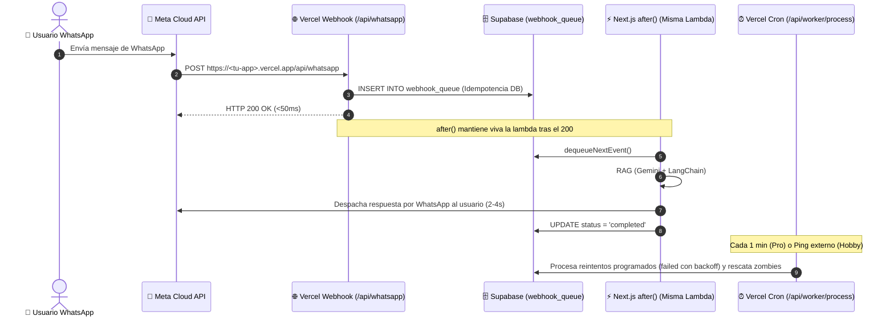

# Guía de Despliegue y Ejecución en Vercel: Webhook Resiliente y Worker Serverless

Esta guía explica cómo desplegar y operar la arquitectura de cola resiliente de **chatIA** ([docs/cola.md:66](file:///Users/gibmyxgomez/Documents/dev/chatIA/docs/cola.md#L66-L74)) en **Vercel**, aprovechando el modelo Serverless sin necesidad de servidores dedicados ni servicios de pago adicionales.

---

## 1. ¿Cómo funciona la arquitectura en Vercel Serverless?

En un servidor tradicional tendrías un proceso infinito `npm run worker`. En Vercel no hay procesos infinitos, por lo que la arquitectura opera en dos tiempos:



1. **Respuestas en Tiempo Real (99% de los mensajes):**
   - Cuando Meta llama a `/api/whatsapp`, el webhook guarda el evento en Supabase y responde `200 OK` a Meta en menos de 50ms.
   - La función nativa `after()` de Next.js mantiene viva la misma instancia Serverless tras enviar la respuesta, ejecuta el pipeline RAG y despacha el mensaje de WhatsApp al usuario en 2 a 4 segundos.
2. **Reintentos con Backoff y Reconciliación (Red de Seguridad):**
   - Si una llamada falla temporalmente (ej. caída de Gemini), el evento queda en la cola con `status = 'failed'` y una fecha futura de reintento (`next_retry_at`).
   - El endpoint `/api/worker/process` es invocado periódicamente vía **Vercel Cron** para procesar estos reintentos y ejecutar la reconciliación.

---

## 2. Variables de Entorno Requeridas en Vercel

En el panel de tu proyecto en Vercel (**Project Settings** -> **Environment Variables**), configura las siguientes claves:

| Variable | Descripción | Ejemplo |
|---|---|---|
| `GOOGLE_API_KEY` | Clave de API de Google Gemini (RAG y Embeddings) | `AQ.Ab8RN6Le...` |
| `SUPABASE_URL` | URL de tu proyecto Supabase | `https://xxxx.supabase.co` |
| `SUPABASE_SERVICE_ROLE_KEY` | Clave de rol de servicio de Supabase (con permisos DML) | `sb_secret_...` o `eyJhbGci...` |
| `WHATSAPP_VERIFY_TOKEN` | Token secreto que defines para el handshake GET con Meta | `chatia_token_secreto_2026` |
| `WHATSAPP_ACCESS_TOKEN` | Token de acceso del sistema o temporal de Meta Graph API | `EAAYh5GtnH...` |
| `WHATSAPP_PHONE_NUMBER_ID` | Identificador del número telefónico de prueba en Meta | `1258887770648904` |
| `CRON_SECRET` | *(Opcional pero recomendado)* Token aleatorio para proteger `/api/worker/process` | `mi_secreto_cron_super_seguro_2026` |

---

## 3. Configuración en Meta for Developers

Una vez desplegada tu aplicación en Vercel:

1. Ve a [developers.facebook.com/apps](https://developers.facebook.com/apps/) -> Tu Aplicación -> **WhatsApp** -> **Configuración** (*Configuration*).
2. En la sección **Webhook**:
   - **URL de devolución de llamada:** `https://<tu-proyecto>.vercel.app/api/whatsapp`
   - **Token de verificación:** El mismo valor que pusiste en `WHATSAPP_VERIFY_TOKEN`.
3. Haz clic en **Verificar y Guardar** (*Verify and Save*). Meta enviará un GET de prueba; tu aplicación responderá con el `hub.challenge` y quedará verificado en verde.
4. En **Campos de Webhook** (*Webhook fields*), haz clic en **Administrar** (*Manage*) y suscríbete a:
   - `messages` (Obligatorio).

---

## 4. Planes de Vercel: Hobby (Gratuito) vs Pro

### Si estás en Vercel Hobby (Gratuito):
- **Respuestas en tiempo real:** Funcionan al 100% gracias a `after()`. El usuario no nota ninguna diferencia; recibe su respuesta en segundos.
- **Vercel Crons en Hobby:** Vercel permite solo 1 ejecución diaria de Cron en el plan Hobby.
- **Solución para reintentos y reconciliación en Hobby:**
  - Puedes crear una tarea gratuita en [cron-job.org](https://cron-job.org) o [UptimeRobot](https://uptimerobot.com) que haga un `GET` cada 1 o 5 minutos a:
    `https://<tu-proyecto>.vercel.app/api/worker/process?secret=TU_CRON_SECRET`
  - O configurar un **Database Webhook** en Supabase para que dispare `/api/worker/process` ante inserciones en `webhook_queue`.

### Si estás en Vercel Pro:
- El archivo [`vercel.json`](file:///Users/gibmyxgomez/Documents/dev/chatIA/vercel.json) ya configurado en el proyecto ejecutará el cron cada 1 minuto de forma automática y desatendida:
  ```json
  {
    "crons": [
      {
        "path": "/api/worker/process",
        "schedule": "*/1 * * * *"
      }
    ]
  }
  ```

---

## 5. Verificación del Despliegue

### 1. Probar el endpoint worker manualmente:
```bash
curl -X GET "https://<tu-proyecto>.vercel.app/api/worker/process?secret=TU_CRON_SECRET"
```
Respuesta esperada:
```json
{
  "status": "success",
  "timestamp": "2026-09-13T12:50:00.000Z",
  "processedCount": 0,
  "results": [],
  "reconciliation": {
    "resetCount": 0,
    "metrics": { "pending": 0, "processing": 0, "completed": 0, "failed": 0, "dlq": 0 }
  }
}
```

### 2. Probar el flujo completo de WhatsApp:
Envía una pregunta desde tu teléfono registrado al número de WhatsApp de prueba.
Revisa en los **Logs de Vercel** en tiempo real:
- Verás: `POST /api/whatsapp 200 in ~40ms`.
- Verás: `⚡ [Vercel after()] Procesando evento wamid... en background...`.
- Verás: `🤖 [Worker] Respuesta generada: ...`.
- Verás la respuesta llegar a tu WhatsApp.
