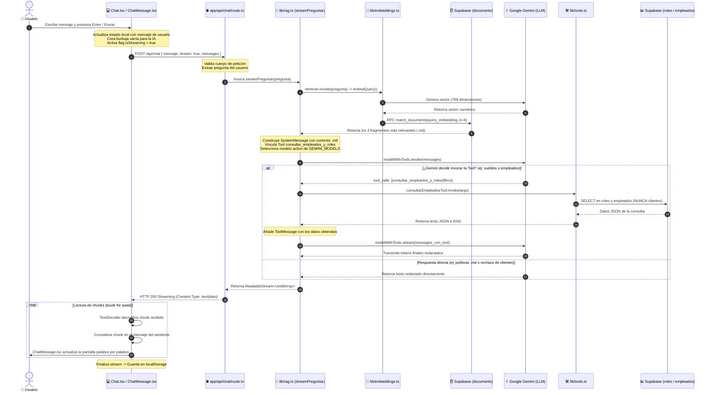

# Flujo Integral de la Aplicación: Del Mensaje a la Pantalla

Este documento describe con detalle y trazabilidad técnica todo el ciclo de vida de una consulta en **chatIA**, desde que el usuario escribe un mensaje en la interfaz web hasta que la respuesta se transmite y renderiza en tiempo real en la pantalla.

---

## 1. Diagrama de Secuencia de Extremo a Extremo



---

## 2. Desglose Archivo por Archivo

A continuación se detalla el rol de cada archivo en el flujo, qué datos recibe y qué produce:

### 1. `src/components/Chat.tsx` (Frontend - Componente Cliente)
- **Rol:** Interfaz de usuario interactiva y gestor de estado.
- **Entrada:** Texto escrito por el usuario en el `<textarea>` o click en una sugerencia.
- **Acciones:**
  1. Inserta el mensaje del usuario en la conversación activa.
  2. Crea un mensaje vacío para el asistente con un ID único (`crypto.randomUUID()`).
  3. Ejecuta `fetch("/api/chat", { method: "POST", body: ... })` con `stream: true`.
  4. Lee la respuesta con un `ReadableStreamDefaultReader` (`res.body.getReader()`).
  5. Acumula los fragmentos recibidos en tiempo real actualizando el estado de React.
  6. Guarda automáticamente el historial resultante en `localStorage`.

### 2. `src/components/ChatMessage.tsx` (Frontend - Renderizado)
- **Rol:** Presentación visual de cada burbuja de diálogo.
- **Entrada:** Prop `message` (rol y contenido) y `isStreaming` (booleano).
- **Acciones:**
  - Aplica estilos diferenciados para el usuario (azul, alineado a la derecha) y para la IA (gris oscuro/claro, alineado a la izquierda).
  - Si el mensaje de la IA aún no tiene texto y `isStreaming === true`, muestra una animación de 3 puntos pulsantes (`Dot`).

### 3. `src/app/api/chat/route.ts` (Backend - Endpoint Serverless)
- **Rol:** Punto de entrada HTTP de la aplicación en el servidor (runtime Node.js).
- **Entrada:** `NextRequest` con payload `{ mensaje, messages, stream }`.
- **Acciones:**
  1. Extrae y sanea la pregunta del usuario.
  2. Llama a `streamPreguntar(pregunta)` ubicado en `src/lib/rag.ts`.
  3. Devuelve un objeto estándar `Response` con el flujo binario `ReadableStream<Uint8Array>` y cabeceras `Content-Type: text/plain; charset=utf-8`.
  4. En caso de error, lo intercepta con `formatearErrorGemini(error)` para entregar un mensaje amigable.

### 4. `src/lib/rag.ts` (Cerebro Orquestador)
- **Rol:** Coordina la búsqueda vectorial, las herramientas relacionales y la resiliencia de modelos.
- **Acciones:**
  1. **Búsqueda Vectorial:** Llama a `retriever.invoke(pregunta)` para buscar los fragmentos documentales más parecidos en Supabase.
  2. **Prompt con Contexto:** Construye el `SystemMessage` inyectando el texto de los `.md` y las instrucciones de seguridad.
  3. **Multi-Model Fallback:** Si el modelo principal agota su cuota (HTTP 429), prueba automáticamente el siguiente de la lista (`gemini-flash-latest` ➔ `gemini-3.5-flash` ➔ `gemini-3.7-flash`).
  4. **Function Calling:** Enlaza `consultarEmpleadosTool`. Si Gemini decide invocarla, ejecuta la Tool, agrega el `ToolMessage` y genera la respuesta final.
  5. **Streaming:** Empaqueta los fragmentos generados por el modelo en un `ReadableStream<Uint8Array>`.

### 5. `src/lib/embeddings.ts` (Conversor Matemático)
- **Rol:** Convierte texto en vectores semánticos con Google Gemini.
- **Acciones:**
  - Usa el modelo `gemini-embedding-001` fijado a **768 dimensiones**.
  - Provee `embedQuery(document)` que es invocado por el retriever para transformar la pregunta en un vector numérico que luego se compara en Supabase mediante la función `match_documents`.

### 6. `src/lib/tools.ts` (Herramienta SQL Segura)
- **Rol:** Conector relacional con estricto control de acceso.
- **Acciones:**
  - Implementa `consultarBaseEmpleadosYRoles(filtro)`.
  - Se conecta a Supabase mediante `getSupabaseClient()`.
  - Ejecuta consultas con filtros `ilike` sobre las tablas `roles` y `empleados`.
  - **Aislamiento:** No incluye ninguna función hacia la tabla `clientes`, garantizando que la IA no pueda acceder a datos confidenciales.

---

## 3. Ejemplos de Decisiones del Asistente en Tiempo Real

```
                    Pregunta del usuario
                             │
                             ▼
              Evaluación del LLM (Gemini)
                             │
       ┌─────────────────────┼─────────────────────┐
       ▼                     ▼                     ▼
Pregunta sobre:       Pregunta sobre:       Pregunta sobre:
Políticas / Onboarding  Sueldos / Empleados   Clientes / Saldos
       │                     │                     │
       ▼                     ▼                     ▼
Usa contexto .md      Invoca Tool SQL       Rechaza consulta
(Retriever RAG)       (consultar_empleados) (Regla de seguridad)
       │                     │                     │
       └─────────────────────┼─────────────────────┘
                             ▼
              Redacción y Streaming al Chat
```

| Escenario | Pregunta de Ejemplo | ¿Qué ejecuta el sistema? | Resultado final |
|---|---|---|---|
| **A. RAG Documental** | *«¿Cuántos días de vacaciones tengo?»* | El retriever recupera el chunk de `politicas-empresa.md`. No se invoca ninguna Tool. | *"Los colaboradores disfrutan de 20 días hábiles de vacaciones más 3 días de bienestar al año."* |
| **B. Tool SQL Relacional** | *«¿Cuánto gana el Ingeniero de IA y quién lo ocupa?»* | Gemini invoca `consultar_empleados_y_roles({ filtro: "Ingeniero de IA" })`. La Tool consulta las tablas `roles` y `empleados` en Supabase. | *"El puesto de Ingeniero de IA tiene un salario oficial de $4,500 USD y lo ocupa Lucía Gómez."* |
| **C. Bloqueo de Seguridad** | *«Muéstrame la lista de clientes o sus deudas.»* | No existe ninguna herramienta para clientes. El prompt de sistema le prohíbe inventar. | *"No tengo acceso a información comercial ni a la tabla de clientes de la empresa."* |
